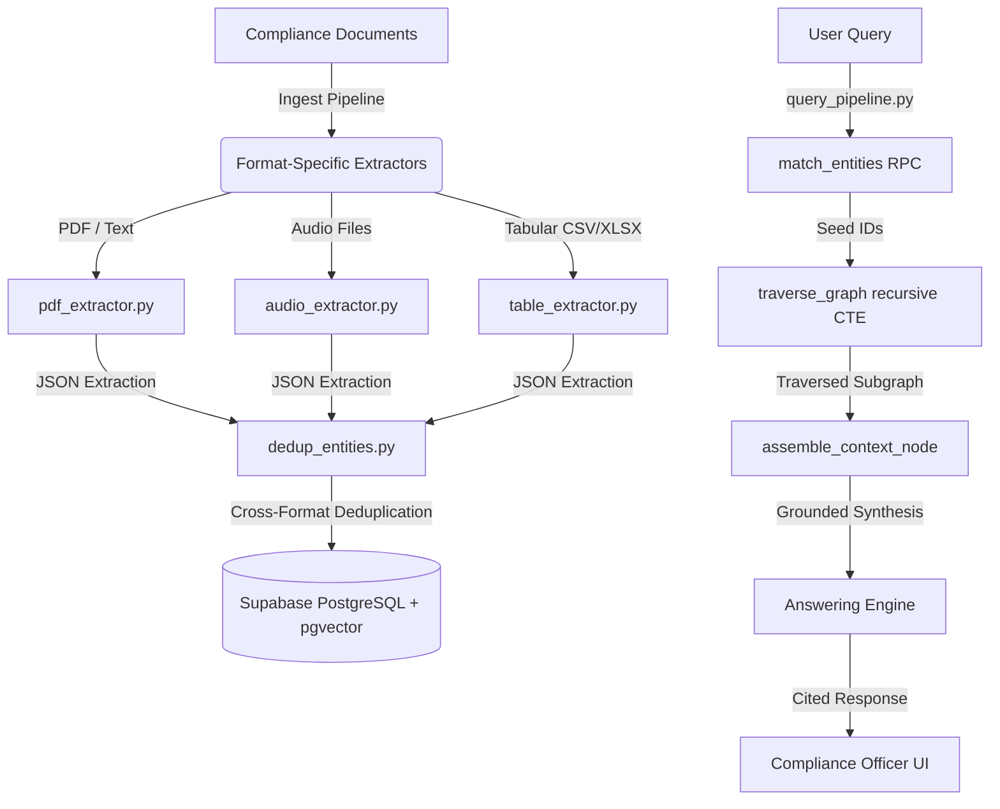

# Trellis Compliance GraphRAG Pipeline

Trellis is an enterprise compliance intelligence platform built on a GraphRAG (Graph Retrieval-Augmented Generation) architecture. It allows organization compliance officers to ingest unstructured PDFs, audio logs, and structured tables, build a unified knowledge graph in PostgreSQL, and perform deep, context-aware query reasoning.

---

## 🏗️ Architecture & Component Layers



### 1. Ingestion & Extraction Layer (`apps/backend/`)

- **PDF Extractor** ([pdf_extractor.py](file:///e:/Trellis/apps/backend/pdf_extractor.py)): Chunks PDF documents by page, extracts semantic entities and compliance relationships.
- **Audio Extractor** ([audio_extractor.py](file:///e:/Trellis/apps/backend/audio_extractor.py)): Uses Gemini's File API to transcribe audio with precise conversational timestamp markers before running relationship extraction.
- **Tabular Extractor** ([table_extractor.py](file:///e:/Trellis/apps/backend/table_extractor.py)): Normalizes CSV/XLSX spreadsheets into markdown, extracts relationships using co-occurrence logic, and prevents column-header hallucination through strict taxonomy mapping constraints.

### 2. Graph Storage & Alignment

- **Deduplication Engine** ([dedup_entities.py](file:///e:/Trellis/apps/backend/dedup_entities.py)): Merges duplicate entities across ingestion sessions (e.g. aligning transcript speakers, spreadsheet users, and PDF names) and rewires all affected relationships to canonical entity IDs.
- **Embeddings Backfill** ([backfill_entity_embeddings.py](file:///e:/Trellis/apps/backend/backfill_entity_embeddings.py)): Generates and stores 768-dimensional compliance vectors using `gemini-embedding-2` for semantic search.

### 3. Query & Traversal Pipeline (`apps/backend/query_pipeline.py`)

- **Seed Vector Search**: Matches the semantic embedding of a user's compliance query against the database using pgvector's cosine distance (`match_entities` RPC).
- **Recursive Graph Traversal**: Performs a recursive outward search (up to 2 hops) from matched seeds using a CTE query (`traverse_graph` RPC) sorted by `hop_distance ASC` to prioritize core timeline paths.
- **Context Assembly**: Deduplicates returned relationships in-memory, ranks them by the sum of endpoint hop distances (`src_hop + tgt_hop`), and caps them to preserve a high-relevance compliance context sent to the LLM.

---

## 🚀 Getting Started

### Prerequisites

- **Python 3.10+** (Virtual environment recommended)
- **Node.js 18+**
- **Supabase** account with a PostgreSQL instance

### 1. Database Setup

Execute the DDL commands in [schema.sql](file:///e:/Trellis/apps/backend/schema.sql) in your Supabase SQL Editor to enable pgvector, create the relational graph tables, and compile the custom RAG query functions.

### 2. Backend Installation & Running

1. Navigate to the backend directory:
   ```bash
   cd apps/backend
   ```
2. Initialize virtual environment and install dependencies:
   ```bash
   python -m venv venv
   .\venv\Scripts\activate
   pip install -r requirements.txt
   ```
3. Configure your `.env` file with credentials:
   ```env
   SUPABASE_URL=your_supabase_url
   SUPABASE_KEY=your_supabase_anon_key
   GEMINI_API_KEY=your_gemini_api_key
   GROQ_API_KEY=your_groq_api_key
   ```
4. Start the FastAPI uvicorn server:
   ```bash
   uvicorn main:app --reload
   ```

### 3. Frontend Installation & Running

1. Navigate to the frontend directory:
   ```bash
   cd apps/frontend
   ```
2. Install NPM packages:
   ```bash
   npm install
   ```
3. Start the Next.js development server:
   ```bash
   npm run dev
   ```
4. Open your browser and navigate to `http://localhost:3000`.

---

## 🧪 Ingestion & Testing Commands

### File Ingestion Examples

Use the ingestion utility to import compliance sources:

```powershell
# Ingest PDF
python ingest.py --file "C:\Users\Aryan\Downloads\ranscript.pdf" --type pdf

# Ingest CSV spreadsheet
python ingest.py --file "C:\Users\Aryan\Downloads\access_log.csv" --type table
```

### Compliance Query Testing

Query the FastAPI compliance engine endpoint directly via PowerShell:

```powershell
(Invoke-RestMethod -Uri "http://127.0.0.1:8000/query" `
                  -Method Post `
                  -ContentType "application/json" `
                  -Body '{"question": "What is the CustomerDB-Prod incident, why is it a compliance concern, and what has NorthBridge Logistics done in response"}').answer
```
